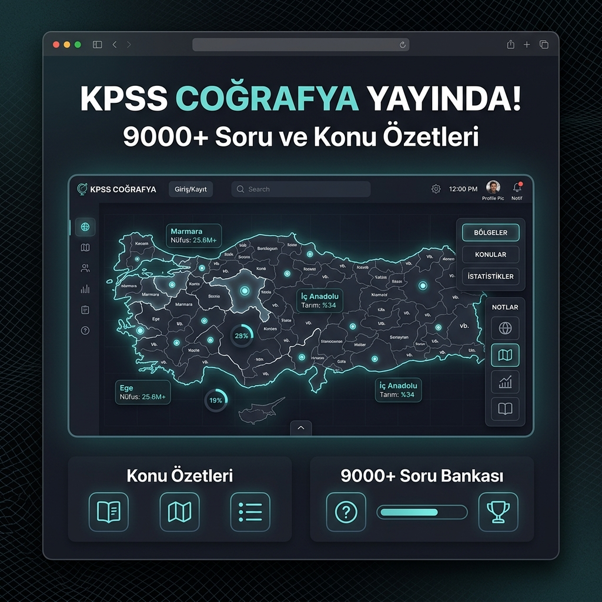
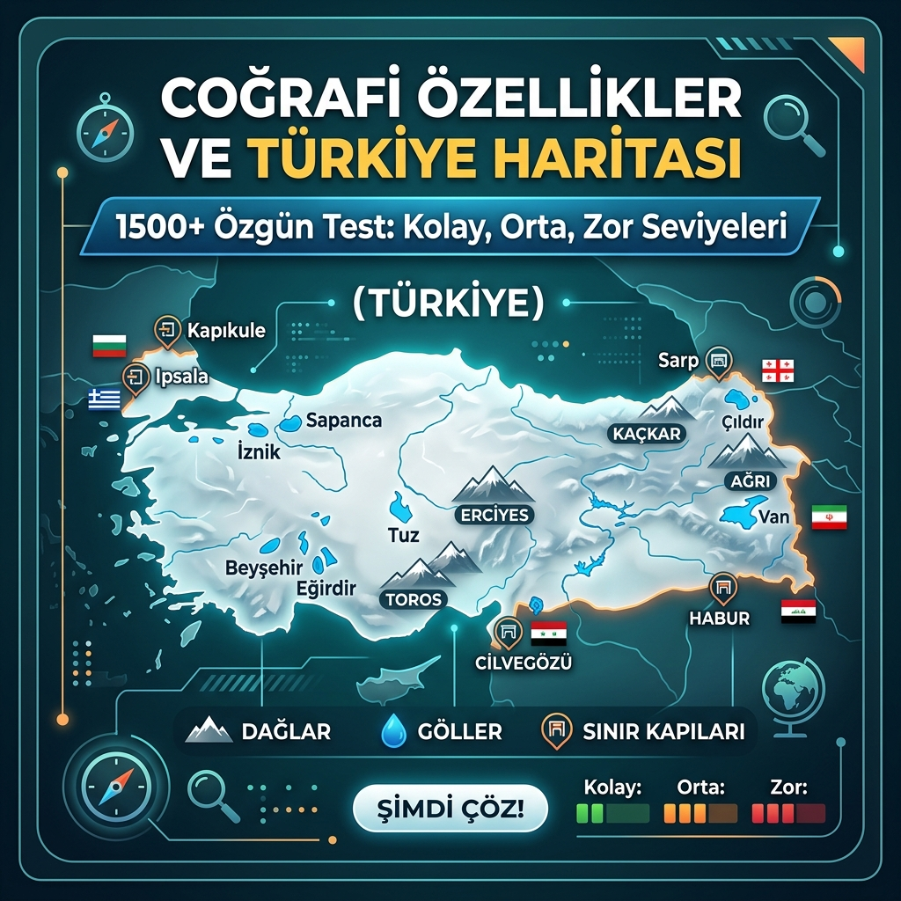
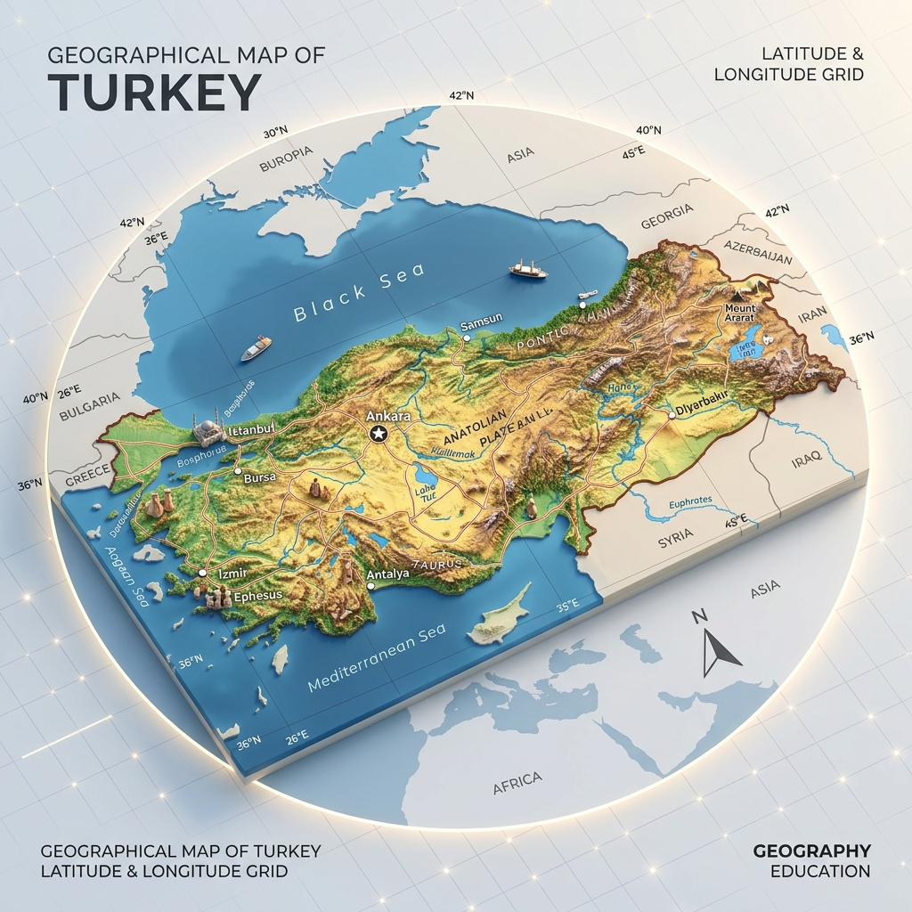

# KPSS Coğrafya Web Application - Advanced Architecture & Study Engine

- GitHub Repository: https://github.com/Dpehect/KPSS-Cografya-Web-App
- Live Demo: https://kpss-cografya-web-app.vercel.app/

This project is a high-performance, enterprise-grade educational web application designed for the KPSS Geography exam preparation. It features a massive database of questions, interactive level-based tests, flashcards for active recall, and dynamic topic summaries with visual mappings.

## Core Architectural Pillars

- **Framework**: Next.js utilizing App Router and Turbopack for optimized build performance.
- **Language**: TypeScript for complete compile-time type safety across all components and data structures.
- **Database & Sync**: Supabase with SSR and custom seeding, backed by a local-first fallback mechanism for zero-latency loading.
- **Styling & Layout**: Custom utility system built on top of Tailwind CSS v4, supporting customized dataset dark mode variants (`data-theme="dark"`).

## Social Media & Instagram Promotion

Below are the 1x1 promotional square posts designed for Instagram sharing:

| Post 1 (Launch) | Post 2 (Features) | Post 3 (Methods) |
| :---: | :---: | :---: |
|  |  |  |
| **KPSS Coğrafya Yayında!**   9000+ Soru & Detaylı Konu Özetleri | **1500+ Özgün Test!**   Kolay, Orta, Zor Seviyeleri | **Aktif Tekrar Kartları**   Coğrafyayı Hafızana Sabitle! |
